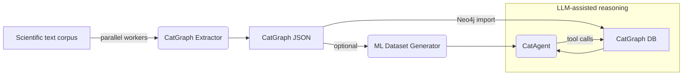

# CatData Extractor v3 — Core Component Overview

*Prepared for heterogeneous-catalysis researchers exploring Large-Language-Model (LLM) workflows*

---

## 1  Architectural Snapshot
CatData Extractor v3 transforms raw textual artefacts (papers, patents, ELNs) into structured knowledge that can be **queried, learned from, and reasoned over**.  The system is composed of three tightly-coupled modules:

| # | Module | Primary script | Purpose |
|---|---------|---------------|---------|
| 1 | **CatGraph Extractor** | `extract_main.py → extract_catgraph(…)` | Build a Neo4j-ready knowledge-graph (CatGraph) from unstructured text. |
| 2 | **ML Dataset Generator** | `extract_main.py → generate_ml_dataset(…)` | Distil CatGraph into downstream ML tasks. |
| 3 | **CatAgent (+ Tools)** | `service/agent_setup.py` | Augment an LLM with graph & analytics tools to answer domain questions with evidence. |

A high-level dataflow is illustrated below:



---

## 2  CatGraph Extractor
### 2.1  Scientific Rationale
Catalysis experiments encode multi-step synthesis routes, reaction conditions and performance metrics that are **difficult for traditional parsers** to capture.  CatGraph Extractor uses a domain-fine-tuned LLM (default = *Google Gemini 2.5 Pro*) to convert prose into a graph whose nodes (Chemical, Synthesis, Testing, …) and relations match the schema in `docs/neo4j_schema.md`.

### 2.2  Processing Pipeline (per file)
1. **File discovery**   Recursively gather inputs matching `--file-ext` (default `.md`).
2. **Worker initialisation**   Spawn a process; load the LLM through `models.get_model` (temperature configurable via `MODEL_TEMP`).
3. **Prompted extraction**   `extract_catgraph()` instructs the LLM to identify entities, create UUIDs, normalise field names and emit JSON.
4. **Post-validation**   Checks missing mandatory entities/edges and logs flags such as `missing_items_found_in_check`.
5. **Output materialisation**
   * `output_dir/graph/<run_id>_output.json` — CatGraph
   * `output_dir/metadata/<run_id>_result.json` — status & usage telemetry

### 2.3  Key CLI Usage
```bash
python -m CATDA.extract_main \
    my_papers/ \
    --mode extract \
    --processes 8 \
    --output-dir 2024-05-CatGraph
```

### 2.4  Implementation & Text-Handling Details
* **Pre-processing**  The raw document is ingested as UTF-8 and sanitised by `remove_control_symbols()` to delete page-break glyphs, zero-width spaces and other artefacts that confound tokenisation.  Additional regex steps normalise whitespace and collapse LaTeX math blocks into inline text so the LLM sees a clean, contiguous narrative.
* **Progressive prompting**  Extraction runs in **two LLM turns per domain**:
  1. `synthesis_graph_prompt` → initial graph.
  2. `synthesis_missing_check_prompt` → self-critique & patch instructions (handled by `_apply_graph_changes`).
* **Robust JSON parsing**  Outputs are parsed with `json5.loads` to tolerate trailing commas and unquoted keys—common LLM quirks.  A fallback direct parse is attempted when fenced-code blocks are missing.
* **Context preservation**  Each node retains a `source_text` excerpt (≤300 chars) that anchors the graph fact back to its sentence of origin, enabling downstream evidence retrieval.
* **Graph surgery utilities**  `_apply_graph_changes` supports fine-grained deletions/updates/additions so the LLM can correct itself without re-generating the entire graph—crucial for long papers where token limits prevent full re-emission.
* **Catalyst-ID propagation**  Catalyst UUIDs extracted from synthesis are fed verbatim into the testing prompts, ensuring that performance results are linked to the *exact* material instance described earlier.

---

## 3  ML Dataset Generator
### 3.1  Motivation
While CatGraph is amenable to Cypher queries, **LLM fine-tuning** benefits from explicit instruction–response records.  The generator traverses each graph, formulates domain-relevant questions (e.g., *"What is the activation energy of Ni/Al₂O₃ in CO methanation at 1 bar?"*) and records the ground-truth answer extracted from the graph.

### 3.2  Operational Modes
| Mode | Invocation | Behaviour |
|------|------------|-----------|
| Inline | `--mode both` | Triggered immediately after each successful extraction. |
| Stand-alone | `--mode generate-ml-only` | Scan `output_dir/graph/*_output.json` and (re)generate dataset rows. |

### 3.3  Output Schema (simplified)
```json
{
  "instruction": "string",
  "input": "string (subgraph or metadata)",
  "output": "string (gold answer)",
  "run_id": "string"
}
```
Rows are consolidated into `.jsonl`/Parquet files compatible with HuggingFace `datasets` or `trl`.

### 3.4  Instruction Generation Strategy & Coverage
* **Template library**  `generate_ml_dataset()` samples from ~15 prompt templates spanning *property lookup*, *condition comparison*, *synthesis-path explanation*, *unit conversion* and *evidence justification* tasks.
* **Dynamic slot-filling**  Place-holders (catalyst name, test temperature, metric key, etc.) are auto-filled from the graph, producing questions that exactly match the available facts—no hallucinated attributes.
* **Balanced difficulty**  Heuristics ensure a mix of *easy* (single-hop) and *hard* (multi-relation) questions to train chain-of-thought reasoning.
* **Provenance linkage**  Each row carries the `run_id` so mispredictions during model training can be traced back to the originating paper paragraph.
* **Negative samples**  ~10 % of rows deliberately ask for information *not present* in the graph; the correct response is an explicit "not found" statement.  This teaches the model to abstain when evidence is lacking.

---

## 4  CatAgent — Tool-Augmented Reasoning Engine
CatAgent embeds an LLM inside a **LangChain tool-calling agent** that can autonomously decide when to invoke specialised utilities.  This design yields factual, traceable answers instead of free-form hallucinations.

### 4.1  Mounted Tool-belt
 • SynthesisPathRetriever: Trace synthesis steps backward for a target Catalyst or Chemical from literature.
 • GraphSchema: Retrieve the graph schema (node labels, relationship types, property keys).
 • NameResolver: Resolve ambiguous entity names (Catalyst, Chemical, BasicMaterial) to canonical graph identifiers.
 • FieldNameResolver: Translate natural language metrics/conditions (e.g., 'conversion') into canonical graph property keys.
 • EvidenceFetcher: Fetch citation details and source text snippets for specific nodes using their `original_id`.
 • UnitConverter: Convert numerical values between specified units.
 • GraphQuery: Fallback tool for execute a read-only Cypher query to fetch graph data if above tool can not meet requirements.

### 4.2  Reasoning Workflow Example
1. **User query**: *"Compare the ethylene conversion of Ni₂Fe vs. Ni/SiO₂ at 350 °C."*
2. **Agent plan**: `NameResolverTool` → canonical names; `GraphQueryTool` → fetch results; optional `UnitConverterTool`.
3. **Answer**: Returns a Markdown table with numbers **and** inline citations produced via `EvidenceFetcherTool`.

### 4.3  Deployment Options
* Interactive Python shell / Jupyter notebook
* FastAPI micro-service for lab chatbots
* Batch analytics pipelines (e.g., ranking hundreds of candidate catalysts)

### 4.4  Knowledge-Grounded Reasoning Mechanics
* **Prompt structure**  `ChatPromptTemplate` inserts a JSON block enumerating tool names & signatures, followed by `MessagesPlaceholder`s for chat history and the agent scratchpad.  The LLM therefore "knows" when to emit a `tool_call` JSON object.
* **Decision loop**  After each LLM step, LangChain executes the requested tool, appends the result as a system message, and re-invokes the LLM.  This continues until the model outputs a *final_answer* message.
* **Evidence enforcement**  The system prompt mandates inline citations; if the answer references a numerical claim without provenance, a second-pass validator triggers `EvidenceFetcherTool` automatically.
* **Caching & vector search**  Name/field resolution tools employ FAISS indices that reside in RAM (≤50 ms lookup), while schema queries are cached with a TTL of 1 h to shield Neo4j from redundant calls.
* **Guardrails**  Cypher strings are scanned for mutating keywords (`CREATE`, `MERGE`, etc.) and rejected to maintain database immutability.  Unit conversions rely on `pint`, and quantity parsing is hardened against locale-specific formats (comma decimals, thin spaces).
* **Outcome**  Users receive concise, citation-rich answers, and the agent's internal chain-of-thought remains hidden, satisfying both scientific rigour and confidentiality.

---

## 5  Reproducibility & Extensibility
* **Determinism**   Set `MODEL_TEMP=0.0` and version-control the prompts. (But not recommend. Too low temp will cause llm not reasoning more and )
* **LLM Plug-ins**   `models.get_model` supports OpenAI, DeepSeek, Gemini; adding local LMStudio models requires only a new loader.
* **Schema Evolution**   Forward-compatible node/edge types safeguarded by validation logic.
* **Open Dataset**   The ML dataset is stored in research-friendly formats for public release under CC-BY-4.0.
